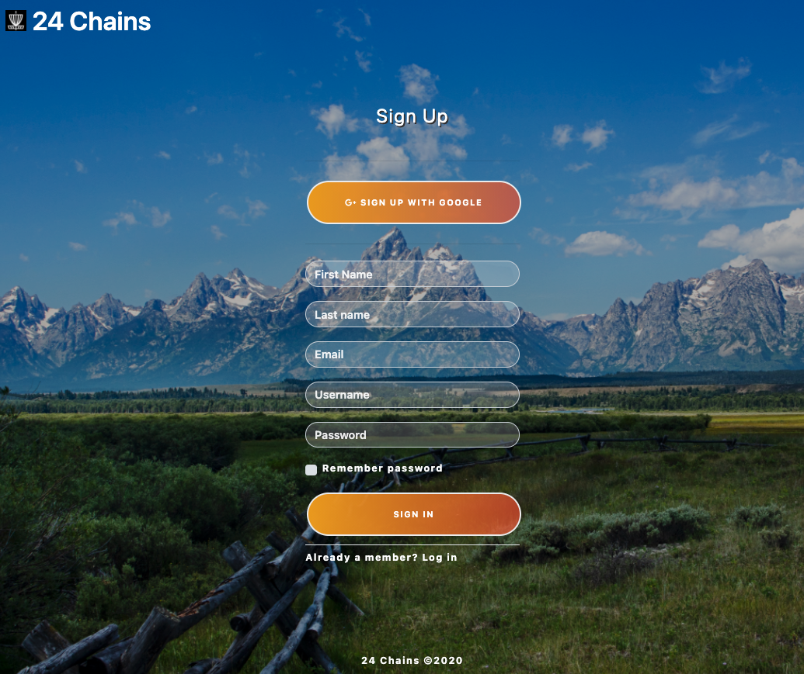
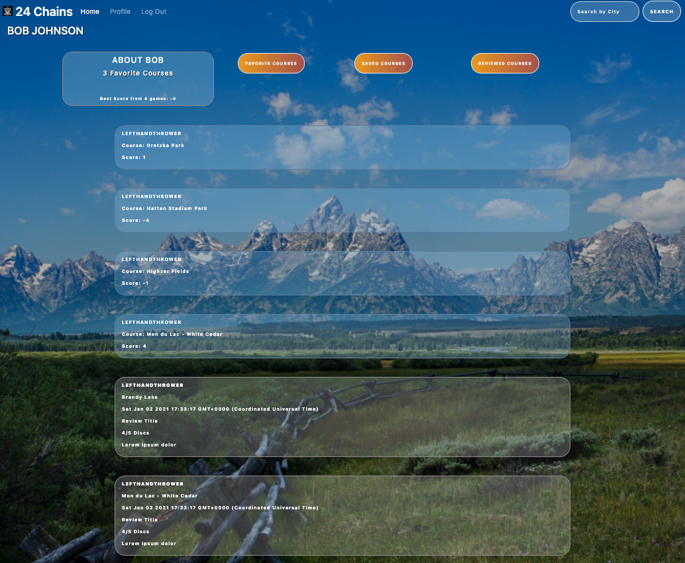

# 24-chains

 [Live Site](https://dry-mesa-09626.herokuapp.com/) / [Github](https://github.com/MarynaPR/24-chains)
### images :camera_flash:

### description :page_with_curl:

Our group built an interactive website for all disc golf enthusiasts. Disc Golf is played much like golf, but instead of a ball and clubs, players use a flying disc or frisbee. It is thrown from a tee area to a target, which is an elevated metal basket with chains. The target, that has 24 metal chains, served as an inspiration for the name of this application - `24-chains`. Because disc golf is so easy to learn and play, it welcomes people of all ages, gender identity and economic status, making it a great lifetime fitness activity. One fo the great features that disc golf has is that it is the most sustainable sport facility to produce, with new courses being installed every day. It can even coexist with existing park facilities.
With growing popularity of disc golf due to flexible schedule, low barrier to entry, distancing due to pandemic and a sheer fun of the game, this app was created to connect users in Wisconsin area. It allows members to log in, search for the next place nearby to play disc golf, and celebrate their achievements by rating and writing reviews on their played courses or saving the course to their profile. 

### user story:

- As a user when I go to the website, I am presented with a log in or sign up page. 
- As a user when I search for a specific course by city, then I am presented with a list of courses with a brief description including name of the course, number of holes, par and year course was established.
- As a user I can post reviews and save my favorite courses.
 - As a user on my profile page I am presented with  with `about me` section and courses by categories:  favorite, saved and reviewed.
- As a user when I go to the home page I see the list of all members, their score and the course they played. 
- As a user I can log out. 

### badges/technologies :label: 

         

### resources :wrench: 

* [express-handlebars](https://www.npmjs.com/package/express-handlebars)
* [mySQL2](https://www.npmjs.com/package/mysql2)
* [sequelize](https://www.npmjs.com/package/sequelize) 
* [dotenv package](https://www.npmjs.com/package/dotenv)
* [bcrypt package](https://www.npmjs.com/package/bcrypt)
* [express-session](https://www.npmjs.com/package/express-session)
* [connect-session-sequelize](https://www.npmjs.com/package/connect-session-sequelize)
* [handlebars](https://handlebarsjs.com/)
* [bootstrap](https://getbootstrap.com/)
* [fontsawesome](https://fontawesome.com/)
* [emoji-cheat-sheet:for readme](https://github.com/ikatyang/emoji-cheat-sheet)

### installation :electric_plug:

* download files from this repo
* install necessary dependencies with `npm install`
* run `npm start` at the root of the directory to connect to the server
### contributing :heavy_plus_sign: 

Contributions, [issues](https://github.com/MarynaPR/24-chains/issues) and feature requests of any kind are welcome!   Please follow the [Standard Contributor Covenant](https://www.contributor-covenant.org/) when looking to make any additions to this project. 
Give :star: if you found this project useful. 

### creators :star2:

[Nate Derenne](https://github.com/njderenne)
[Austin Price](https://github.com/frostyausty)
[Duncan Martin](https://github.com/DuncanMarten)
[Maryna Pryadka](https://github.com/MarynaPR)

### questions :question: 
Feel free to contact with any questions.
